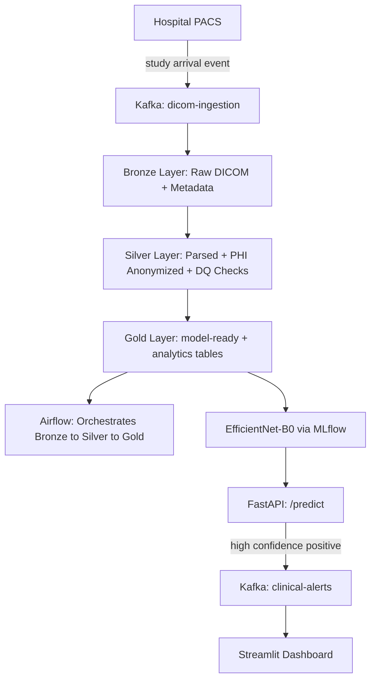

# Medical Imaging Lakehouse

End-to-end medallion lakehouse for medical imaging — Kafka ingestion, PySpark/Delta Lake Bronze/Silver/Gold pipeline, Airflow orchestration, EfficientNet-B0 pneumonia classifier with MLflow tracking, FastAPI serving with real-time Kafka alerting, and a Streamlit dashboard.

## Architecture



## Tech Stack

| Tool | Role |
|---|---|
| GitHub Codespaces | Dev environment |
| Docker | Postgres, Kafka, Zookeeper, FastAPI containers |
| PostgreSQL | Legacy hospital metadata source |
| Apache Kafka (confluent-kafka) | Ingestion events + clinical alerts |
| PySpark 4.1 + Delta Lake 4.1 | Bronze/Silver/Gold pipeline |
| pydicom + OpenCV | DICOM parsing, PHI anonymization, image preprocessing |
| Hand-rolled PySpark DQ checks | Schema completeness, referential integrity, duplicate detection, age range validity |
| Apache Airflow 3.2 | Orchestration |
| PyTorch + timm | EfficientNet-B0 training (Google Colab) |
| MLflow | Experiment tracking |
| FastAPI | Model serving + Kafka producer |
| Streamlit | Dashboard (Ops, Clinical Analytics, Live Alerts) |
| GitHub Actions | CI/CD |

## Dataset

RSNA Pneumonia Detection Challenge — 15,659 training chest X-ray DICOM studies, binary pneumonia labels.

## Project Structure
├── bronze/          # Raw Delta tables + audit log

├── silver/          # Cleaned Delta tables + processed images

├── gold/            # Model-ready + analytics Delta tables

├── etl/

│   ├── bronze/      # Kafka producer/consumer, Postgres JDBC ingestion, audit logging

│   ├── silver/      # DICOM parsing, anonymization, image preprocessing, DQ checks

│   └── gold/        # Patient-aware split, model-ready table, analytics aggregates

├── airflow_home/dags/  # Airflow DAG

├── api/             # FastAPI service + Dockerfile

├── dashboard/       # Streamlit dashboard

├── models/          # Trained model checkpoint

├── docs/            # Data dictionary, model card

├── tests/           # pytest suite

└── jars/            # Postgres JDBC + Delta Lake JARs

## Setup

```bash
poetry install
docker compose up -d
docker exec medical-imaging-lakehouse-kafka-1 kafka-topics --create --topic dicom-ingestion --bootstrap-server localhost:9092 --partitions 1 --replication-factor 1
docker exec medical-imaging-lakehouse-kafka-1 kafka-topics --create --topic clinical-alerts --bootstrap-server localhost:9092 --partitions 1 --replication-factor 1
```

Load the dataset:
```bash
kaggle competitions download -c rsna-pneumonia-detection-challenge -p data/raw
unzip data/raw/rsna-pneumonia-detection-challenge.zip -d data/raw
```

Run the pipeline:
```bash
poetry run python etl/bronze/producer.py
poetry run python etl/bronze/consumer.py
poetry run python etl/bronze/metadata_ingest.py
poetry run python etl/silver/dicom_metadata_ingest.py
poetry run python etl/silver/image_preprocess.py
poetry run python etl/silver/dq_checks.py
poetry run python etl/gold/model_ready.py
poetry run python etl/gold/analytics_summary.py
```

Or via Airflow:
```bash
export AIRFLOW_HOME=$(pwd)/airflow_home
poetry run airflow standalone
poetry run airflow dags unpause medical_imaging_pipeline
poetry run airflow dags trigger medical_imaging_pipeline
```

Run the API and dashboard:
```bash
poetry run uvicorn api.main:app --reload --port 8000
poetry run streamlit run dashboard/app.py
```

Run tests:
```bash
poetry run pytest tests/ -v
```

## Dashboard

Three views in `dashboard/app.py`:

- **Pipeline Ops** — run history from the audit log, DQ pass rates per check
- **Clinical Analytics** — case volumes by modality/view/diagnosis, demographic breakdowns
- **Live Alerts** — real-time feed from `clinical-alerts`, showing high-confidence pneumonia predictions

## Scope Note

Image preprocessing covers 3,000 of 15,659 available DICOM files (full metadata parsing covers all 15,659) due to local disk constraints in development. Model trained on this subset.