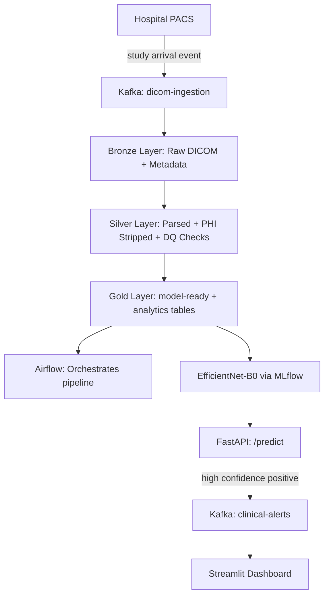

# Medical Imaging Lakehouse

End-to-end medallion lakehouse for medical imaging with Kafka, Delta Lake, Airflow, and FastAPI.

## Architecture

## Tech Stack

| Tool | Role |
|---|---|
| GitHub Codespaces | Dev environment |
| Docker | Postgres and Kafka |
| PostgreSQL | Legacy hospital metadata source |
| Apache Kafka | Ingestion events + clinical alerts |
| PySpark + Delta Lake | Bronze/Silver/Gold pipeline |
| AWS S3 | Data lake storage |
| pydicom + OpenCV | DICOM parsing and image processing |
| Great Expectations | Data quality framework |
| Apache Airflow | Orchestration |
| PyTorch + timm | EfficientNet-B0 training |
| MLflow | Experiment tracking |
| FastAPI | Model serving |
| Streamlit | Dashboard |
| GitHub Actions | CI/CD |

## Dataset

RSNA Pneumonia Detection Challenge — 26,000 chest X-ray DICOM studies with binary pneumonia labels.

## Project Structure

├── bronze/       # Raw Delta tables

├── silver/       # Cleaned Delta tables

├── gold/         # Model-ready Delta tables

├── etl/          # PySpark jobs

├── dags/         # Airflow DAGs

├── api/          # FastAPI service

├── dashboard/    # Streamlit dashboard

└── tests/        # pytest suite

