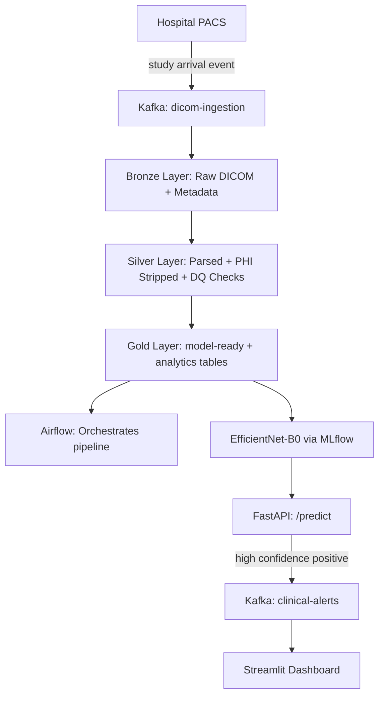

# Medical Imaging Lakehouse

End-to-end medallion lakehouse for medical imaging with Kafka, Delta Lake, Airflow, and FastAPI.

## Architecture



## Tech Stack

| Tool | Role |
|---|---|
| GitHub Codespaces | Dev environment |
| Docker | Postgres and Kafka |
| PostgreSQL | Legacy hospital metadata source |
| Apache Kafka | Ingestion events + clinical alerts |
| PySpark + Delta Lake | Bronze/Silver/Gold pipeline |
| AWS S3 | Data lake storage |
| pydicom + OpenCV | DICOM parsing and image processing |
| Great Expectations | Data quality framework |
| Apache Airflow | Orchestration |
| PyTorch + timm | EfficientNet-B0 training |
| MLflow | Experiment tracking |
| FastAPI | Model serving |
| Streamlit | Dashboard |
| GitHub Actions | CI/CD |

## Dataset

RSNA Pneumonia Detection Challenge — 26,000 chest X-ray DICOM studies with binary pneumonia labels.

## Project Structure

├── bronze/       # Raw Delta tables

├── silver/       # Cleaned Delta tables

├── gold/         # Model-ready Delta tables

├── etl/          # PySpark jobs

├── dags/         # Airflow DAGs

├── api/          # FastAPI service

├── dashboard/    # Streamlit dashboard

└── tests/        # pytest suite

## Scoping Decisions & Known Limitations

A few deliberate choices made during development, worth understanding in context:

**Image preprocessing scope:** Of the 15,659 training DICOM files, the full Silver `dicom_metadata` table covers all 15,659 records, but `images_processed` (decoded/normalized/resized PNGs) covers 3,000 due to local disk constraints in the dev environment (GitHub Codespaces, 32GB volume). The pipeline logic is designed to scale to the full dataset given more storage — this was a development-environment tradeoff, not an architectural limitation.

**Great Expectations → hand-rolled PySpark DQ checks:** Originally planned to use Great Expectations for the data quality framework. Swapped to hand-rolled PySpark checks (schema completeness, referential integrity, duplicate detection) after evaluating the dependency footprint — Great Expectations pulled in 74 additional packages (Jupyter, multiple validators, etc.) for functionality that's straightforward to implement directly. The hand-rolled approach produces the same `dq_results` Delta table and is arguably a clearer demonstration of understanding *what* a DQ framework needs to check, not just configuring one.

**Referential integrity finding:** The DQ suite caught a real, explainable gap — RSNA's `stage_2_detailed_class_info.csv` contains labels for more patients (26,684 distinct) than exist as raw DICOM files across train+test (18,659 combined), a known quirk of how RSNA structured their staged data release. This is flagged by the referential integrity check rather than silently ignored.

**Infrastructure version-matching:** Getting Kafka, Spark, Delta Lake, and Java working together in this environment required resolving several compatibility issues: switching from `kafka-python` to `confluent-kafka` after diagnosing silent consumer failures (heartbeat timeouts in the unofficial client), downgrading the active Java version from 25 to 17 for Spark/Hadoop compatibility, and matching Delta Lake's Scala-tagged build (`delta-spark_4.1_2.13`) to Spark 4.1.2's Scala 2.13 runtime. These are documented here because diagnosing them was as valuable as the pipeline code itself.
**Airflow setup — pip standalone mode instead of Docker Compose:** The official Airflow Docker Compose quick-start recommends 10GB+ disk and 4GB+ RAM minimum, running 5+ containers (webserver, scheduler, dag-processor, worker, triggerer). Given this project's disk constraints, Airflow was installed directly via pip and run in `standalone` mode instead — a lighter-weight approach common for local development that bundles scheduler and webserver in one process with SQLite as the metadata store.

**Two non-obvious Airflow bugs diagnosed during setup:**
1. An `os.chdir()` call at module-import time inside the DAG file silently broke the DAG processor's ability to parse it — Airflow's scanner logged "Filling up the DagBag" repeatedly with no error, making this hard to diagnose. Fixed by removing the module-level `chdir()` and passing `cwd=` explicitly to each subprocess call instead.
2. Airflow's `dags_are_paused_at_creation` defaults to `true` — a newly-discovered DAG can be triggered and will show a queued run, but no tasks ever execute until `airflow dags unpause <dag_id>` is run explicitly.

**Kafka's `KAFKA_ADVERTISED_LISTENERS` required a dual-listener setup for cross-container access.** The original Week 2 config (`PLAINTEXT://localhost:9092`) worked for clients running directly in the Codespace, but broke when the FastAPI service was containerized — Docker containers can't reach each other via `localhost`. Fixed by configuring two listeners: `PLAINTEXT` (`localhost:9092`, for external/Codespace clients) and `PLAINTEXT_INTERNAL` (`kafka:29092`, for other Docker containers on the same network), with `KAFKA_LISTENER_SECURITY_PROTOCOL_MAP` and `KAFKA_INTER_BROKER_LISTENER_NAME` configured accordingly.

**Kafka producer `flush()` had no timeout, risking an indefinite hang.** During Docker testing with Kafka temporarily unreachable, the `/predict` endpoint hung indefinitely because `producer.flush()` blocked forever waiting for a broker that would never respond. Fixed with `flush(timeout=2.0)` wrapped in a try/except — a downstream notification failure (Kafka) should never be able to break the primary service (predictions). This is documented as a deliberate resilience pattern, not just a bug fix.

**Model checkpoint (16MB) is committed directly to git**, rather than using Git LFS or external storage. At this size, it's well within GitHub's comfortable range and keeps the repository fully self-contained — anyone cloning it can run the API immediately without a separate model download or retraining step.

## Dashboard

The Streamlit dashboard (`dashboard/app.py`) provides three views:

- **Pipeline Ops** — run history from the audit log, DQ pass rates per check type, and the full DQ results table
- **Clinical Analytics** — case volumes by modality/view position/diagnosis, demographic breakdowns by sex and age bucket
- **Live Alerts** — real-time feed from the `clinical-alerts` Kafka topic, showing high-confidence (>70%) pneumonia predictions as they're generated by the FastAPI service

Run it locally with:

```bash
poetry run streamlit run dashboard/app.py
```